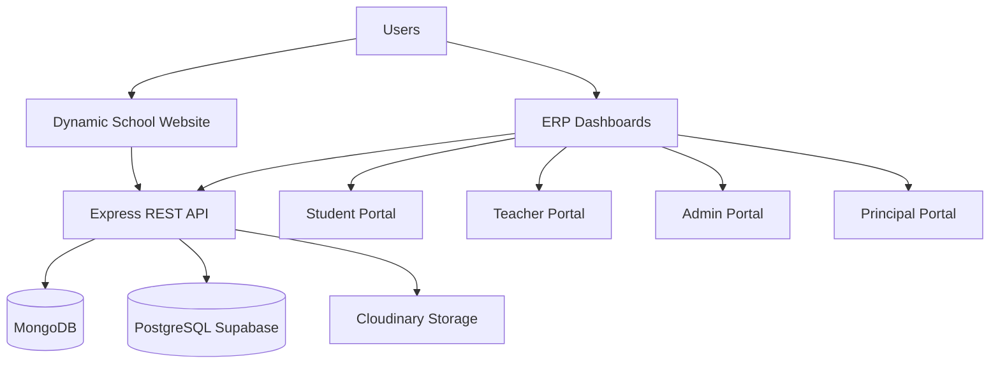
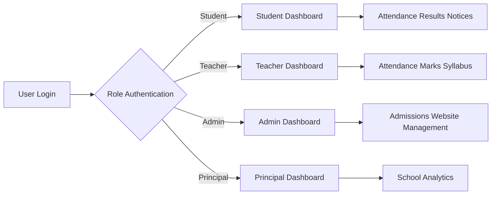
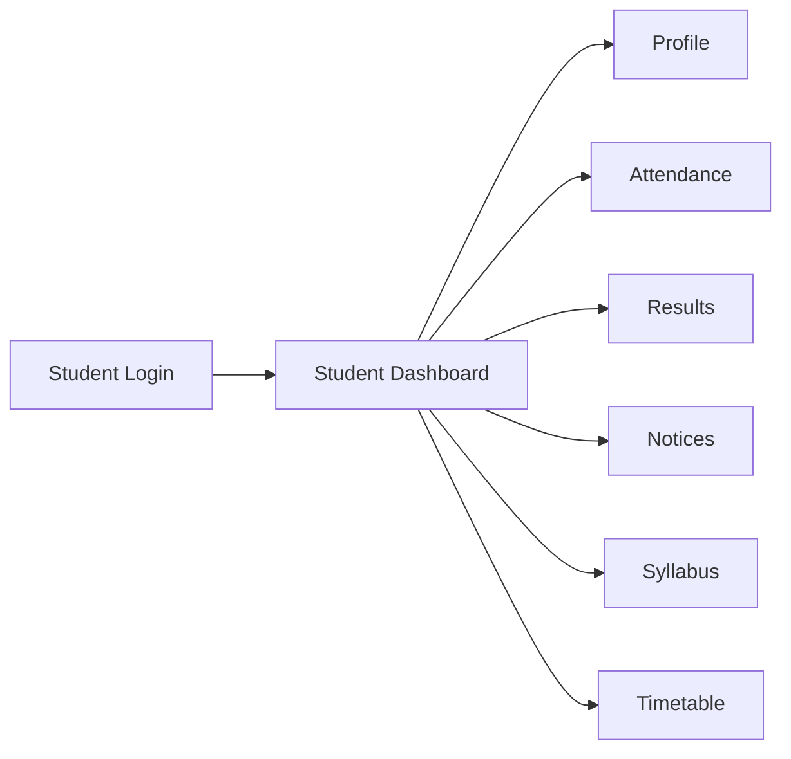
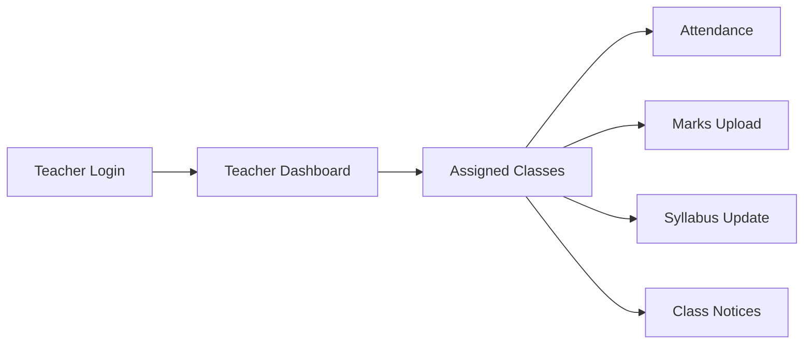
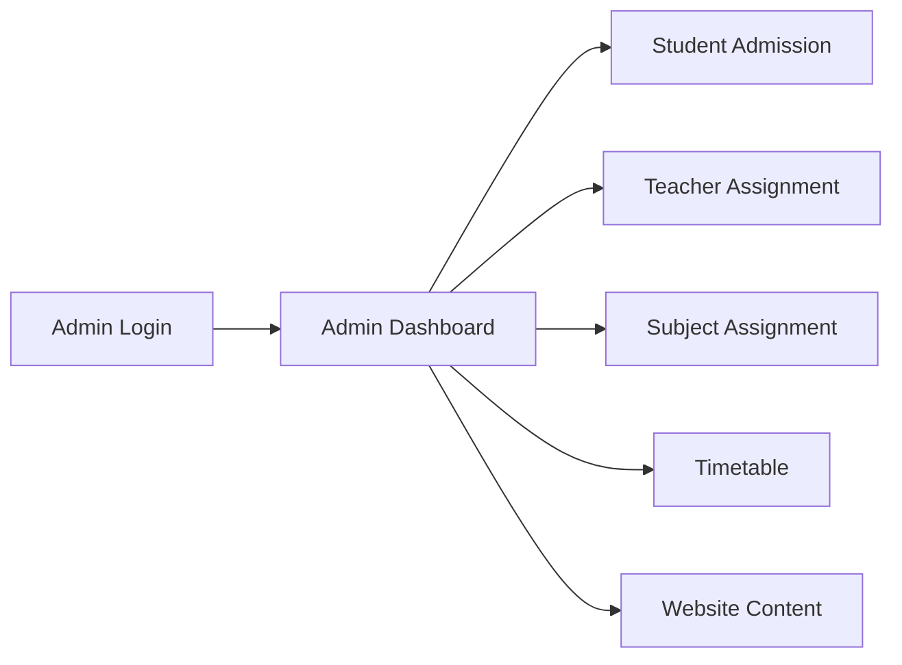
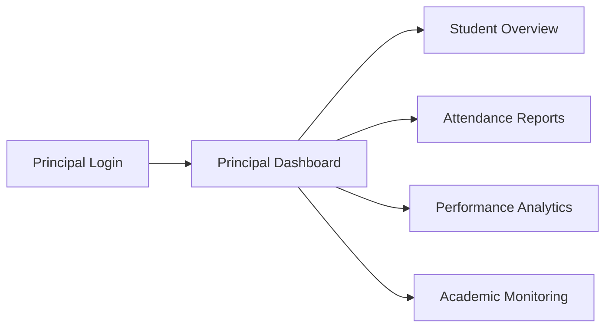
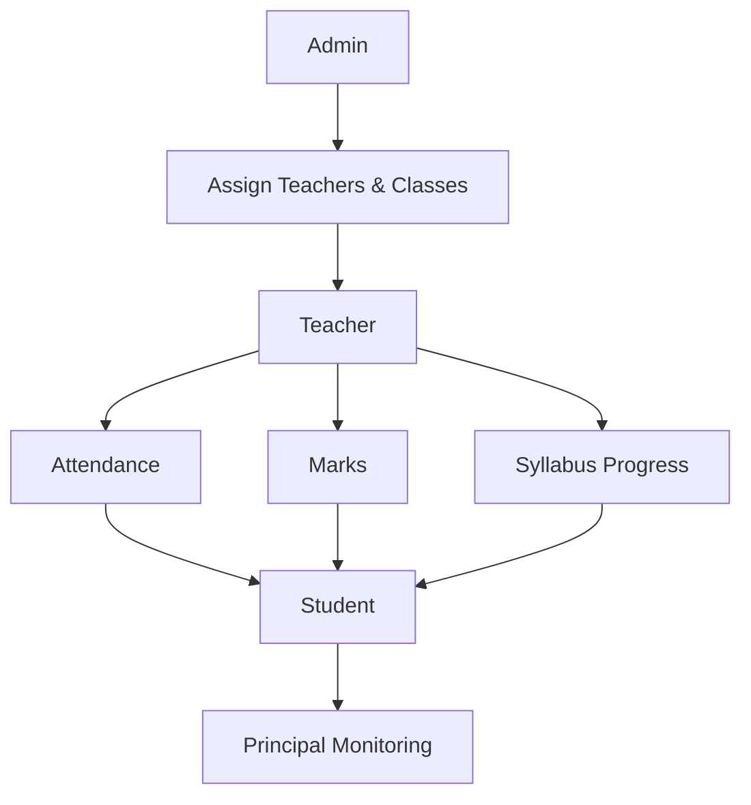

# 🎓 EduCore ERP

<div align="center">


<br/>

## 🏫 Complete School Website + ERP Management System

### A Full-Stack Digital Platform for Managing Students, Teachers, Administration & School Operations

<br/>

<p align="center">


</p>


<p align="center">

<a href="https://erp-frontend-eight-iota.vercel.app/">


</a>

<a href="https://github.com/Ankit-nehra/erp-frontend">


</a>

</p>


⭐ If you like this project, consider giving it a star.

</div>


---

# 📖 Overview

**EduCore ERP** is a complete **School Website + Enterprise Resource Planning (ERP)** system designed to digitize school operations and improve communication between students, teachers, administrators, and principals.

The platform combines:

- A dynamic public school website
- A role-based ERP management system
- Academic tracking
- Attendance management
- Examination management
- Student performance monitoring

EduCore ERP provides separate dashboards for:

| Role | Purpose |
|---|---|
| 👨‍🎓 Student | Access personal academic information |
| 👩‍🏫 Teacher | Manage assigned classes and academic activities |
| 👨‍💼 Admin | Control school operations and website content |
| 🎓 Principal | Monitor overall school performance |

---

# 🚀 Problem & Solution

## ❌ Traditional School Management Problems

| Problem | Impact |
|---|---|
| Manual attendance records | Time consuming and error prone |
| Paper-based results | Difficult performance tracking |
| Separate communication systems | Information delay |
| Manual website updates | Requires technical dependency |
| Limited student analytics | Difficult decision making |

## ✅ EduCore ERP Solution

| Solution | Benefit |
|---|---|
| Digital attendance system | Faster and accurate records |
| Online marks management | Easy result tracking |
| Role-based dashboards | User-specific access |
| Dynamic website CMS | Admin controlled updates |
| Performance analytics | Better monitoring |

---

# ✨ Features

## 🌐 Dynamic School Website

The website provides a digital presence for the school and allows administrators to manage public content.

| Feature | Description |
|---|---|
| 📰 Notices | Publish important announcements |
| 🖼 Gallery | Upload school images |
| 🏆 Achievements | Showcase school achievements |
| 🏫 School Information | Display institution details |
| 📞 Contact Section | Provide communication details |

---

## 🏫 ERP Management System

EduCore ERP provides four dedicated dashboards.

| Dashboard | Major Responsibilities |
|---|---|
| 👨‍🎓 Student Portal | Profile, attendance, results, notices, timetable |
| 👩‍🏫 Teacher Portal | Attendance, marks, syllabus, class management |
| 👨‍💼 Admin Portal | Admissions, assignments, website management |
| 🎓 Principal Portal | Performance and school monitoring |

---

# 📚 Table of Contents

- [Overview](#-overview)
- [Problem & Solution](#-problem--solution)
- [Features](#-features)
- [Tech Stack](#-tech-stack)
- [System Architecture](#-system-architecture)
- [Website Module](#-website-module)
- [ERP Modules](#-erp-modules)
  - [Student Portal](#-student-portal)
  - [Teacher Portal](#-teacher-portal)
  - [Admin Portal](#-admin-portal)
  - [Principal Portal](#-principal-portal)
- [Screenshots](#-screenshots)
- [Installation](#-installation)
- [Environment Variables](#-environment-variables)
- [Folder Structure](#-folder-structure)
- [API Documentation](#-api-documentation)
- [Deployment](#-deployment)
- [Future Roadmap](#-future-roadmap)
- [Contribution](#-contribution)
- [License](#-license)

---
# 🛠 Tech Stack

EduCore ERP is built using modern full-stack technologies with a separate database architecture for website content and ERP operations.

<table>

<tr>

<td width="33%">

## 🎨 Frontend

| Technology | Usage |
|---|---|
| ⚛️ React.js | User Interface |
| 🔀 React Router | Navigation |
| 📡 Axios | API Communication |
| 🎨 CSS / Tailwind CSS | Styling |

</td>

<td width="33%">

## ⚙ Backend

| Technology | Usage |
|---|---|
| 🟢 Node.js | Server Runtime |
| 🚂 Express.js | REST API |
| 🔐 JWT | Authentication |
| 📤 Multer | File Handling |
| ☁️ Cloudinary | Image Storage |

</td>

<td width="33%">

## 🗄 Database

| Technology | Usage |
|---|---|
| 🍃 MongoDB | Website Data |
| 🐘 PostgreSQL | ERP Data |
| ⚡ Supabase | PostgreSQL Platform |
| 📦 pg | PostgreSQL Client |

</td>

</tr>

</table>


---

# 🏗 System Architecture

EduCore ERP follows a modular full-stack architecture where website data and ERP data are managed separately.



---

# 🔄 System Workflow



---

# 🧩 Application Structure

```
EduCore ERP

│
├── 🌐 Public School Website
│
│   ├── Home Page
│   ├── About School
│   ├── Notices
│   ├── Gallery
│   ├── Achievements
│   └── Contact
│
│
└── 🏫 ERP Management System
    │
    ├── 👨‍🎓 Student Portal
    │
    ├── 👩‍🏫 Teacher Portal
    │
    ├── 👨‍💼 Admin Portal
    │
    └── 🎓 Principal Portal

```

---

# 🌐 Website Module

The public website represents the school's online presence.

All website content is dynamically managed through the admin dashboard.

## Website Features

| Module | Description |
|---|---|
| 🏠 Home Page | School introduction and highlights |
| 📰 Notice Management | Publish announcements |
| 🖼 Gallery Management | Upload school images |
| 🏆 Achievement Section | Showcase school achievements |
| 🏫 School Information | Manage public details |
| 📞 Contact Section | Display communication information |

---

# 👨‍💼 Website Content Management

Administrators can manage website content without modifying source code.

| Admin Action | Status |
|---|---|
| Upload Gallery Images | ✅ |
| Create Notices | ✅ |
| Add Achievements | ✅ |
| Edit Content | ✅ |
| Delete Content | ✅ |

---

# 🏫 ERP Overview

The ERP system provides separate role-based dashboards where each user can access only the information and actions assigned to their responsibilities.

| Role | Main Responsibilities |
|---|---|
| 👨‍🎓 Student | View academic information and personal records |
| 👩‍🏫 Teacher | Manage assigned classes and academic activities |
| 👨‍💼 Admin | Manage complete school operations |
| 🎓 Principal | Monitor school performance |

---

# 📊 Core ERP Capabilities

| Module | Features |
|---|---|
| 👥 User Management | Role-based access system |
| 📚 Academic Management | Marks, syllabus, timetable |
| 📅 Attendance | Daily and historical attendance |
| 📝 Examination | Test, mid-term and final results |
| 🔔 Communication | Teacher and admin notices |
| 📈 Performance | Student analytics and reports |
| 🏫 Administration | Admissions and assignments |

---

# ⭐ Key Advantages

| Feature | Benefit |
|---|---|
| 🔐 Role-Based Access | Secure user-specific permissions |
| 🗄 Dual Database Design | Separate website and ERP data handling |
| ☁ Cloud Storage | Reliable image management |
| 📊 Performance Tracking | Better academic monitoring |
| 📱 Responsive Interface | Accessible across devices |
| 🧩 Modular Architecture | Easy future expansion |

---
# 🏫 ERP Modules

EduCore ERP contains four role-based portals designed according to the responsibilities of each user.

Each role has controlled access to ensure security and proper data management.

| Role | Access Level | Main Purpose |
|---|---|---|
| 👨‍🎓 Student | Personal Data | View academic information |
| 👩‍🏫 Teacher | Assigned Classes | Manage academic activities |
| 👨‍💼 Admin | Complete System | Manage school operations |
| 🎓 Principal | Monitoring Access | Analyze school performance |

---

# 👨‍🎓 Student Portal

The student portal provides students access to their academic information and daily school activities.

Students can view their personal information, attendance, results, notices, syllabus progress, and timetable.

## Student Features

| Module | Description |
|---|---|
| 👤 Student Profile | View personal details, parents information, blood group, gender, hostel, bus details |
| 📅 Attendance | View monthly attendance and complete attendance history |
| 📝 Results | View test, mid-term, final exam marks and overall performance |
| 🔔 Notices | Receive notices from assigned teachers |
| 📚 Syllabus Progress | Track subject-wise syllabus completion status |
| 🗓 Timetable | View assigned class timetable |

---

## Student Workflow



---

# 👩‍🏫 Teacher Portal

The teacher portal allows teachers to manage only those classes and subjects assigned by the administrator.

Teachers cannot access unauthorized classes or student data.

## Teacher Features

| Module | Description |
|---|---|
| 👤 Teacher Profile | View personal profile information |
| 👨‍🎓 Student Management | View students of assigned classes |
| 📅 Attendance | Take attendance of assigned students |
| 📝 Marks Management | Upload test, mid-term and final exam marks |
| 🔔 Notice Management | Send notices to assigned classes |
| 📚 Syllabus Tracking | Update syllabus progress |
| 🗓 Timetable | View assigned weekly timetable |

---

## Teacher Permission System

| Action | Permission |
|---|---|
| View Assigned Students | ✅ |
| View Student Performance | ✅ |
| Take Attendance | ✅ |
| Upload Marks | ✅ |
| Update Syllabus Progress | ✅ |
| Send Class Notices | ✅ |
| Access Other Classes | ❌ |

---

## Teacher Academic Workflow



---

# 👨‍💼 Admin Portal

The admin portal is the central control system of EduCore ERP.

Administrators manage students, teachers, classes, subjects, timetable, and website content.

---

## Admin Features

| Module | Description |
|---|---|
| 👨‍🎓 Student Admission | Add, edit, view and delete student records |
| 👩‍🏫 Teacher Management | Manage teacher information |
| 🏫 Class Assignment | Assign classes to teachers |
| 📚 Subject Management | Assign subjects to classes |
| 🗓 Timetable Management | Create and upload class timetables |
| 📰 Notice Management | Publish school notices |
| 🖼 Gallery Management | Upload website gallery images |
| 🏆 Achievement Management | Add school achievements |

---

## Admin Control Panel

| Action | Available |
|---|---|
| Manage Students | ✅ |
| Assign Teachers | ✅ |
| Assign Subjects | ✅ |
| Upload Timetable | ✅ |
| Manage Website Content | ✅ |
| Manage Notices | ✅ |
| Manage Gallery | ✅ |
| Manage Achievements | ✅ |

---

## Admin Workflow



---

# 🎓 Principal Portal

The principal portal provides a complete overview of school performance.

The principal can monitor academic activities without modifying operational data.

---

## Principal Features

| Module | Description |
|---|---|
| 👥 Student Overview | View student information |
| 📊 Performance Monitoring | Analyze student academic performance |
| 📅 Attendance Reports | Monitor attendance records |
| 📝 Result Analysis | View marks and examination performance |
| 📚 Academic Tracking | Monitor syllabus progress |

---

## Principal Access

| Feature | Permission |
|---|---|
| View Student Profiles | ✅ |
| View Attendance Reports | ✅ |
| View Marks Performance | ✅ |
| Monitor Teachers | ✅ |
| Modify Academic Data | ❌ |

---

## Principal Workflow



---

# 🔐 Role Permission Matrix

| Feature | Student | Teacher | Admin | Principal |
|---|---|---|---|---|
| View Own Profile | ✅ | ✅ | ✅ | ✅ |
| View Students | ❌ | Assigned Only | ✅ | ✅ |
| Attendance | View Own | Manage Assigned | Manage All | View All |
| Marks | View Own | Upload Assigned | Manage All | View All |
| Notices | Receive | Send Class Notice | Send School Notice | View |
| Timetable | View | Assigned Classes | Manage | View |
| Website Content | ❌ | ❌ | Manage | View |

---

# 🔄 Complete ERP Data Flow



---

# ✅ ERP Module Summary

| Module | Status |
|---|---|
| Student Management | ✅ Completed |
| Teacher Management | ✅ Completed |
| Attendance System | ✅ Completed |
| Examination System | ✅ Completed |
| Notice System | ✅ Completed |
| Syllabus Tracking | ✅ Completed |
| Timetable Management | ✅ Completed |
| Website CMS | ✅ Completed |

---
# 📸 Screenshots

The following screenshots demonstrate the major modules and dashboards available in EduCore ERP.

---

# 🌐 Website

## 🏫 School Website Homepage


---

# 👩‍🏫 Teacher Portal

## 📊 Teacher Dashboard

Teacher dashboard provides quick access to assigned classes, students, attendance, marks, notices, syllabus and timetable.


## 👨‍🎓 Assigned Student List

Teachers can view only students belonging to classes assigned by the administrator.


## 👤 Student Profile View

Teachers can view student information, attendance and academic performance of assigned students.


## 📅 Attendance Management

Teachers can record attendance for their assigned classes.


## 📝 Marks Upload

Teachers can upload test, mid-term and final examination marks.


## 📚 Syllabus Progress Tracking

Teachers can update syllabus status:

- In Progress
- Pending
- Completed


## 🔔 Class Notice Management

Teachers can send notices to assigned classes.


## 🗓 Teacher Timetable

Teachers can view their assigned weekly timetable.


---

# 👨‍🎓 Student Portal

## 📊 Student Dashboard


## 📅 Attendance History

Students can view monthly attendance and complete attendance records.


## 🔔 Student Notices

Students receive notices sent by teachers.


## 📚 Student Syllabus Progress

Students can track subject-wise syllabus completion.


## 🗓 Student Timetable


## 📝 Student Results

Students can view examination marks and overall performance.


---

# 🎓 Principal Portal

## 👥 Student Overview

Principal can monitor student information.


## 📊 Student Performance Details

Principal can analyze student academic information.


---

# 👨‍💼 Admin Portal

## 📊 Admin Dashboard


## 📰 Notice Management

Admin can publish notices visible on the school website.


## 🖼 Gallery Management

Admin can upload and manage school gallery images.


## 🏆 Achievement Management

Admin can showcase school achievements.


## 👨‍🎓 Student Admission Management

Admin can add, update, view and delete student records.


## 🗓 Timetable Management


## 👩‍🏫 Teacher-Class Assignment

Admin assigns teachers to specific classes.


## 📚 Subject-Class Assignment

Admin assigns subjects according to classes.


---

# ⚙ Installation

Follow these steps to run EduCore ERP locally.


## 1️⃣ Clone Repository

```bash
git clone https://github.com/Ankit-nehra/erp-frontend.git

cd erp-frontend
```


## 2️⃣ Install Dependencies

```bash
npm install
```


## 3️⃣ Setup Environment Variables

Create a `.env` file:

```env
# Frontend

VITE_API_URL=your_backend_api_url
```


Backend environment example:

```env
PORT=5000

DATABASE_URL=your_postgresql_connection

MONGO_URI=your_mongodb_connection

JWT_SECRET=your_secret_key

CLOUDINARY_CLOUD_NAME=your_cloud_name

CLOUDINARY_API_KEY=your_api_key

CLOUDINARY_API_SECRET=your_api_secret
```


## 4️⃣ Run Application

Frontend:

```bash
npm run dev
```


Backend:

```bash
npm start
```

---

# 📂 Folder Structure

Example project structure:

```
EduCore ERP

├── frontend
│
│   ├── src
│   │   ├── components
│   │   ├── pages
│   │   ├── routes
│   │   ├── services
│   │   └── assets
│
│
├── backend
│
│   ├── controllers
│   ├── routes
│   ├── models
│   ├── middleware
│   ├── config
│   └── utils
│
└── README.md
```

---

# 📡 API Documentation

API documentation will be available here:

```
<API_DOCUMENTATION_URL>
```

The backend follows REST API architecture.

Main API categories:

| Module | APIs |
|---|---|
| Authentication | Login, Register, Authorization |
| Students | Student management |
| Teachers | Teacher operations |
| Attendance | Attendance management |
| Results | Marks management |
| Notices | Communication |
| Website | Gallery, achievements, notices |

---

# 🚀 Deployment

Recommended deployment stack:

| Service | Usage |
|---|---|
| Vercel | Frontend Hosting |
| Render / Railway | Backend Hosting |
| Supabase | PostgreSQL Database |
| MongoDB Atlas | MongoDB Database |
| Cloudinary | Image Storage |

---

# 🛣 Future Roadmap

Future improvements planned:

| Feature | Status |
|---|---|
| 📱 Mobile Application | Planned |
| 💳 Online Fee Management | Planned |
| 📧 Email Notifications | Planned |
| 📊 Advanced Analytics | Planned |
| 📄 Automated Report Cards | Planned |
| 🔔 Push Notifications | Planned |

---

# 🤝 Contribution

Contributions are welcome.

Steps:

1. Fork this repository
2. Create a new branch

```bash
git checkout -b feature-name
```

3. Commit your changes

```bash
git commit -m "Add new feature"
```

4. Push changes

```bash
git push origin feature-name
```

5. Open a Pull Request

---

# 📜 License

This project is licensed under the MIT License.

You are free to use, modify and distribute this project with proper attribution.

---

# 👨‍💻 Developer

## Ankit Nehra

Full Stack Developer

GitHub:

```
https://github.com/Ankit-nehra
```

LinkedIn:

```
<YOUR_LINKEDIN_PROFILE>
```

Portfolio:

```
<YOUR_PORTFOLIO_URL>
```

---

<div align="center">

## ⭐ Thank You For Visiting EduCore ERP

A complete digital solution for modern educational institutions.

</div>
