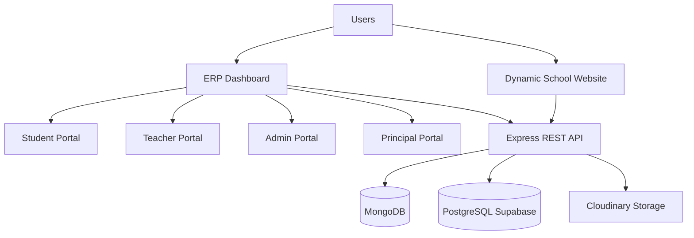
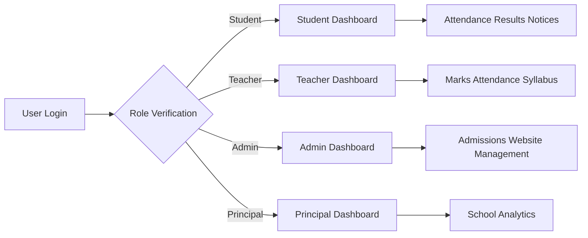

# 🎓 EduCore ERP

<div align="center">


<br/>

# 🏫 EduCore ERP

## Complete School Website + ERP Management System

### A Full-Stack Digital Platform for Managing Students, Teachers, Administration & School Operations

<br/>

<p>


</p>


<p>

<a href="https://erp-frontend-eight-iota.vercel.app/">


</a>


<a href="https://github.com/Ankit-nehra/erp-frontend">


</a>

</p>


⭐ Star this repository if you find it useful.

</div>


---

# 📖 Project Overview

<table>
<tr>

<td width="50%">

## 🌐 School Website

A dynamic public-facing website where schools can showcase:

- School information
- Notices
- Gallery
- Achievements
- Announcements
- Contact details

All website content can be managed dynamically by administrators.

</td>

<td width="50%">

## 🏫 ERP Management System

A complete role-based ERP solution designed for:

- Students
- Teachers
- Administrators
- Principals

It manages academic activities, attendance, examinations, communication, and performance tracking.

</td>

</tr>
</table>


---

# 🚀 Why EduCore ERP?


Traditional school management often requires multiple systems for different activities.

EduCore ERP combines everything into one centralized platform.

| Problem | EduCore ERP Solution |
|---|---|
| Manual attendance records | Digital attendance management |
| Paper-based results | Online examination & marks system |
| Communication gaps | Notice broadcasting system |
| Difficult student tracking | Complete student profile analytics |
| Website updates require developers | Admin controlled dynamic website |
| Lack of performance visibility | Principal monitoring dashboard |


---

# 🎯 Project Vision


EduCore ERP aims to create a complete digital ecosystem for educational institutions.

| Area | Solution Provided |
|---|---|
| 📚 Academic | Marks, syllabus, timetable management |
| 👨‍🎓 Students | Profiles, attendance, results, notices |
| 👩‍🏫 Teachers | Class management and academic tools |
| 👨‍💼 Administration | Admissions and website control |
| 🎓 Principal | School-wide monitoring and analytics |


---

# ✨ Core Features


<table>

<tr>

<td width="25%" align="center">

## 👨‍🎓

### Student Portal

Attendance, Results, Timetable, Notices & Performance Tracking

</td>


<td width="25%" align="center">

## 👩‍🏫

### Teacher Portal

Attendance, Marks Upload, Student Monitoring & Syllabus Tracking

</td>


<td width="25%" align="center">

## 👨‍💼

### Admin Portal

Admissions, Website Management, Teacher Assignment & Timetable

</td>


<td width="25%" align="center">

## 🎓

### Principal Portal

School Analytics, Performance & Attendance Monitoring

</td>

</tr>

</table>


---

# 🌐 Dynamic School Website


| Module | Description |
|---|---|
| 📰 Notices | Publish school announcements |
| 🖼 Gallery | Upload and manage school images |
| 🏆 Achievements | Showcase school achievements |
| 🏫 School Information | Manage public information |
| 📞 Contact | Provide communication details |


---

# 🔐 Security Features


| Feature | Implementation |
|---|---|
| Authentication | JWT Based Login |
| Authorization | Role-Based Access Control |
| API Security | Protected Routes |
| File Security | Multer Validation |
| Media Storage | Cloudinary Integration |


---

# 📊 Academic Management


| Feature | Available |
|---|---|
| Student Attendance | ✅ |
| Monthly Attendance Reports | ✅ |
| Test Marks | ✅ |
| Mid-Term Examination | ✅ |
| Final Examination | ✅ |
| Student Performance Tracking | ✅ |
| Timetable Management | ✅ |
| Syllabus Progress Tracking | ✅ |
| Teacher Notices | ✅ |


---

# 📚 Table of Contents

| Section | Description |
|---|---|
| 📖 Overview | Project introduction |
| 🚀 Why EduCore ERP | Problem & solution |
| 🎯 Vision | Project goals |
| ✨ Features | Main capabilities |
| 🛠 Tech Stack | Technologies used |
| 🏗 Architecture | System design |
| 🌐 Website Module | Public website features |
| 🏫 ERP Overview | Role-based system |
| 👨‍🎓 Student Portal | Student features |
| 👩‍🏫 Teacher Portal | Teacher features |
| 👨‍💼 Admin Portal | Administration features |
| 🎓 Principal Portal | Monitoring features |
| 📸 Screenshots | Application preview |
| ⚙ Installation | Setup guide |
| 🔐 Environment Variables | Configuration |
| 📂 Folder Structure | Project organization |
| 🚀 Deployment | Hosting details |
| 📡 API Documentation | Backend APIs |
| 🛣 Roadmap | Future improvements |
| 🤝 Contribution | Contribution guide |
| 📜 License | Project license |

---

# 🛠 Technology Stack


<table>

<tr>

<td width="50%">

## 🎨 Frontend

| Technology | Purpose |
|---|---|
| ⚛️ React.js | User Interface |
| 🔀 React Router | Client-side Navigation |
| 📡 Axios | API Communication |
| 🎨 CSS / Tailwind | Styling |
| 🔐 JWT | Authentication Handling |

</td>


<td width="50%">

## ⚙ Backend

| Technology | Purpose |
|---|---|
| 🟢 Node.js | Server Runtime |
| 🚂 Express.js | REST API Framework |
| 🔑 JWT | Secure Authentication |
| 📤 Multer | File Upload Handling |
| ☁️ Cloudinary | Cloud Image Storage |

</td>

</tr>

</table>


<br>


<table>

<tr>

<td width="50%">


## 🗄 Database


| Database | Usage |
|---|---|
| 🍃 MongoDB | Website Data |
| 🐘 PostgreSQL | ERP Data |
| ⚡ Supabase | PostgreSQL Platform |


</td>


<td width="50%">


## 🧰 Development Tools


| Tool | Usage |
|---|---|
| Git | Version Control |
| GitHub | Code Hosting |
| Postman | API Testing |
| VS Code | Development |


</td>

</tr>

</table>


---

# 🏗 System Architecture





---

# 🔄 Application Workflow





---

# 🧩 Project Architecture


```
EduCore ERP

│
├── 🌐 School Website
│
│   ├── Home
│   ├── About School
│   ├── Notices
│   ├── Gallery
│   ├── Achievements
│   └── Contact
│
│
└── 🏫 ERP System
    │
    ├── 👨‍🎓 Student Module
    │
    ├── 👩‍🏫 Teacher Module
    │
    ├── 👨‍💼 Admin Module
    │
    └── 🎓 Principal Module

```


---

# 📈 Project Statistics


<table>

<tr>

<td align="center">

## 👥

### 4

User Roles

</td>


<td align="center">

## 📚

### 10+

Major Modules

</td>


<td align="center">

## 🗄

### 2

Database Systems

</td>


<td align="center">

## ☁️

### Cloud

Storage

</td>


</tr>

</table>


| Category | Implementation |
|---|---|
| Frontend | React.js |
| Backend | Express.js + Node.js |
| Website Database | MongoDB |
| ERP Database | PostgreSQL |
| Authentication | JWT |
| Media Storage | Cloudinary |
| API Style | REST API |
| Architecture | Role-Based ERP |


---

# 🌐 Website Module


The website module provides a complete digital identity for the school.

Administrators can update website content without modifying code.


## Website Features


| Feature | Description |
|---|---|
| 🏫 School Information | Display school details |
| 📰 Notices | Publish important announcements |
| 🖼 Gallery | Upload school images |
| 🏆 Achievements | Showcase school achievements |
| 📞 Contact | Communication information |


---

# 👨‍💼 Website Administration


| Admin Action | Available |
|---|---|
| Upload Gallery Images | ✅ |
| Create Notices | ✅ |
| Publish Achievements | ✅ |
| Update Website Content | ✅ |
| Remove Content | ✅ |


---

# 🏫 ERP System Overview


EduCore ERP provides separate dashboards according to user responsibilities.


| Role | Main Responsibilities |
|---|---|
| 👨‍🎓 Student | View profile, attendance, marks, timetable, notices |
| 👩‍🏫 Teacher | Manage assigned classes, attendance, marks, syllabus |
| 👨‍💼 Admin | Manage students, teachers, classes, website |
| 🎓 Principal | Monitor complete school performance |


---

# ⭐ Main Advantages


| Advantage | Benefit |
|---|---|
| 🎯 Role-Based System | Every user sees relevant information |
| ⚡ Digital Workflow | Reduces paperwork |
| 📊 Analytics | Better decision making |
| 🔐 Secure Access | Protected information |
| ☁ Cloud Storage | Reliable media management |
| 📱 Responsive Design | Works across devices |
| 🏗 Scalable Architecture | Easy future expansion |


---
