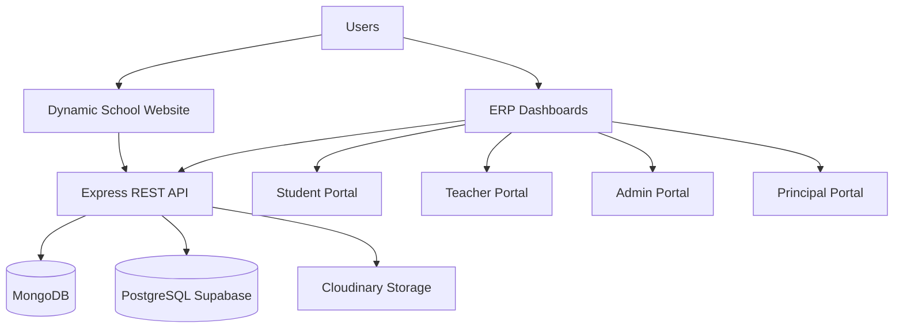
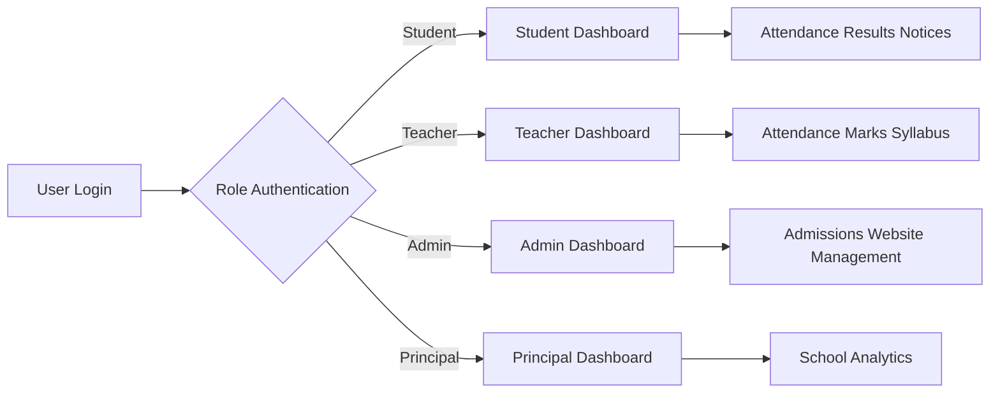

# 🎓 EduCore ERP

<div align="center">


<br/>

## 🏫 Complete School Website + ERP Management System

### A Full-Stack Digital Platform for Managing Students, Teachers, Administration & School Operations

<br/>

<p align="center">


</p>


<p align="center">

<a href="https://erp-frontend-eight-iota.vercel.app/">


</a>

<a href="https://github.com/Ankit-nehra/erp-frontend">


</a>

</p>


⭐ If you like this project, consider giving it a star.

</div>


---

# 📖 Overview

**EduCore ERP** is a complete **School Website + Enterprise Resource Planning (ERP)** system designed to digitize school operations and improve communication between students, teachers, administrators, and principals.

The platform combines:

- A dynamic public school website
- A role-based ERP management system
- Academic tracking
- Attendance management
- Examination management
- Student performance monitoring

EduCore ERP provides separate dashboards for:

| Role | Purpose |
|---|---|
| 👨‍🎓 Student | Access personal academic information |
| 👩‍🏫 Teacher | Manage assigned classes and academic activities |
| 👨‍💼 Admin | Control school operations and website content |
| 🎓 Principal | Monitor overall school performance |

---

# 🚀 Problem & Solution

## ❌ Traditional School Management Problems

| Problem | Impact |
|---|---|
| Manual attendance records | Time consuming and error prone |
| Paper-based results | Difficult performance tracking |
| Separate communication systems | Information delay |
| Manual website updates | Requires technical dependency |
| Limited student analytics | Difficult decision making |

## ✅ EduCore ERP Solution

| Solution | Benefit |
|---|---|
| Digital attendance system | Faster and accurate records |
| Online marks management | Easy result tracking |
| Role-based dashboards | User-specific access |
| Dynamic website CMS | Admin controlled updates |
| Performance analytics | Better monitoring |

---

# ✨ Features

## 🌐 Dynamic School Website

The website provides a digital presence for the school and allows administrators to manage public content.

| Feature | Description |
|---|---|
| 📰 Notices | Publish important announcements |
| 🖼 Gallery | Upload school images |
| 🏆 Achievements | Showcase school achievements |
| 🏫 School Information | Display institution details |
| 📞 Contact Section | Provide communication details |

---

## 🏫 ERP Management System

EduCore ERP provides four dedicated dashboards.

| Dashboard | Major Responsibilities |
|---|---|
| 👨‍🎓 Student Portal | Profile, attendance, results, notices, timetable |
| 👩‍🏫 Teacher Portal | Attendance, marks, syllabus, class management |
| 👨‍💼 Admin Portal | Admissions, assignments, website management |
| 🎓 Principal Portal | Performance and school monitoring |

---

# 📚 Table of Contents

- [Overview](#-overview)
- [Problem & Solution](#-problem--solution)
- [Features](#-features)
- [Tech Stack](#-tech-stack)
- [System Architecture](#-system-architecture)
- [Website Module](#-website-module)
- [ERP Modules](#-erp-modules)
  - [Student Portal](#-student-portal)
  - [Teacher Portal](#-teacher-portal)
  - [Admin Portal](#-admin-portal)
  - [Principal Portal](#-principal-portal)
- [Screenshots](#-screenshots)
- [Installation](#-installation)
- [Environment Variables](#-environment-variables)
- [Folder Structure](#-folder-structure)
- [API Documentation](#-api-documentation)
- [Deployment](#-deployment)
- [Future Roadmap](#-future-roadmap)
- [Contribution](#-contribution)
- [License](#-license)

---
# 🛠 Tech Stack

EduCore ERP is built using modern full-stack technologies with a separate database architecture for website content and ERP operations.

<table>

<tr>

<td width="33%">

## 🎨 Frontend

| Technology | Usage |
|---|---|
| ⚛️ React.js | User Interface |
| 🔀 React Router | Navigation |
| 📡 Axios | API Communication |
| 🎨 CSS / Tailwind CSS | Styling |

</td>

<td width="33%">

## ⚙ Backend

| Technology | Usage |
|---|---|
| 🟢 Node.js | Server Runtime |
| 🚂 Express.js | REST API |
| 🔐 JWT | Authentication |
| 📤 Multer | File Handling |
| ☁️ Cloudinary | Image Storage |

</td>

<td width="33%">

## 🗄 Database

| Technology | Usage |
|---|---|
| 🍃 MongoDB | Website Data |
| 🐘 PostgreSQL | ERP Data |
| ⚡ Supabase | PostgreSQL Platform |
| 📦 pg | PostgreSQL Client |

</td>

</tr>

</table>


---

# 🏗 System Architecture

EduCore ERP follows a modular full-stack architecture where website data and ERP data are managed separately.



---

# 🔄 System Workflow



---

# 🧩 Application Structure

```
EduCore ERP

│
├── 🌐 Public School Website
│
│   ├── Home Page
│   ├── About School
│   ├── Notices
│   ├── Gallery
│   ├── Achievements
│   └── Contact
│
│
└── 🏫 ERP Management System
    │
    ├── 👨‍🎓 Student Portal
    │
    ├── 👩‍🏫 Teacher Portal
    │
    ├── 👨‍💼 Admin Portal
    │
    └── 🎓 Principal Portal

```

---

# 🌐 Website Module

The public website represents the school's online presence.

All website content is dynamically managed through the admin dashboard.

## Website Features

| Module | Description |
|---|---|
| 🏠 Home Page | School introduction and highlights |
| 📰 Notice Management | Publish announcements |
| 🖼 Gallery Management | Upload school images |
| 🏆 Achievement Section | Showcase school achievements |
| 🏫 School Information | Manage public details |
| 📞 Contact Section | Display communication information |

---

# 👨‍💼 Website Content Management

Administrators can manage website content without modifying source code.

| Admin Action | Status |
|---|---|
| Upload Gallery Images | ✅ |
| Create Notices | ✅ |
| Add Achievements | ✅ |
| Edit Content | ✅ |
| Delete Content | ✅ |

---

# 🏫 ERP Overview

The ERP system provides separate role-based dashboards where each user can access only the information and actions assigned to their responsibilities.

| Role | Main Responsibilities |
|---|---|
| 👨‍🎓 Student | View academic information and personal records |
| 👩‍🏫 Teacher | Manage assigned classes and academic activities |
| 👨‍💼 Admin | Manage complete school operations |
| 🎓 Principal | Monitor school performance |

---

# 📊 Core ERP Capabilities

| Module | Features |
|---|---|
| 👥 User Management | Role-based access system |
| 📚 Academic Management | Marks, syllabus, timetable |
| 📅 Attendance | Daily and historical attendance |
| 📝 Examination | Test, mid-term and final results |
| 🔔 Communication | Teacher and admin notices |
| 📈 Performance | Student analytics and reports |
| 🏫 Administration | Admissions and assignments |

---

# ⭐ Key Advantages

| Feature | Benefit |
|---|---|
| 🔐 Role-Based Access | Secure user-specific permissions |
| 🗄 Dual Database Design | Separate website and ERP data handling |
| ☁ Cloud Storage | Reliable image management |
| 📊 Performance Tracking | Better academic monitoring |
| 📱 Responsive Interface | Accessible across devices |
| 🧩 Modular Architecture | Easy future expansion |

---
